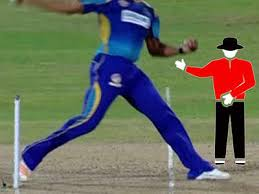
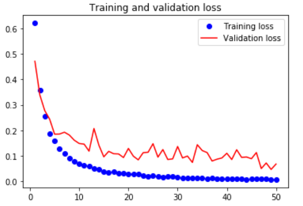

### Project Title

# Legal-balls-and-No-balls-Image-Classification-Competition (Affine Analytics - 17-18 Jan 2020)
This model has been built to classify images as No ball or Legal ball

## Problem Statement
Design an algorithm to detect whether a bowler delivery is a Legal or No-Ball delivery using the images of bowlers in action. Our goal is to measure the probability of an image being a no-ball or not and to make the automated umpiring system and to eliminate the shortcoming of human perception.


## Project structure
├── data\
├── images\
├── models\
│   └── No_ballResNet50DineTune.h5\
├── src\
│   └── Training.ipynb\
│   └── test.ipynb\
├── submissions\
├── requirements.txt\
└── License

### Prerequisites

- GPU(s) with 16Gb RAM (e.g. Tesla V100)

```bash
pip install -r requirements.txt
```

### Usage

#### Data
Our input dataset contains images collected from google image search and various video clips from live matches.
The images are manually annotated and contains two classes: no ball and valid ball(legal ball). 


### Overview
- All the collected images were rescaled to normalise the data in order to have better accuracy.
- Model used for transfer learning - Resnet50
- In our model we have not include the top layer of the Resnet50 and kept the trained  parameters of available model.
- Except for the first five layers of the model all layers of Resnet50 are converted into non-trainable layers.
- One Dense layer of size 300 is also added after Resnet50 and after which the model is trained.






### Challenges and Steps to increase further Accuracy 
- Increase the size of the training dataset.
- We can train the model for more epochs if train dataset size is increased.
- We can collect more data from the ongoing matches.
- If size of training dataset is increased then we can update model accordingly in order to achieve better accuracy.

#### Summary
 
- Data Collection
- Manual Annotation of data
- Transfer learning
- Cross entropy loss
- Adam Optimizer
- Resnet50
